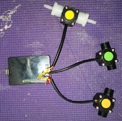

dalek-status
==========




Overview
--------

An embedded flow state tracking server that streams information to Webtrends Streams™


Requirements
------------

nodejs >= 0.10


Install
-------

```
npm install
```

Running
-------
```
./run.sh
```

Todo
-----

* [brewerydb-node](https://github.com/ronandi/brewerydb-node)
* sapi client app connection

